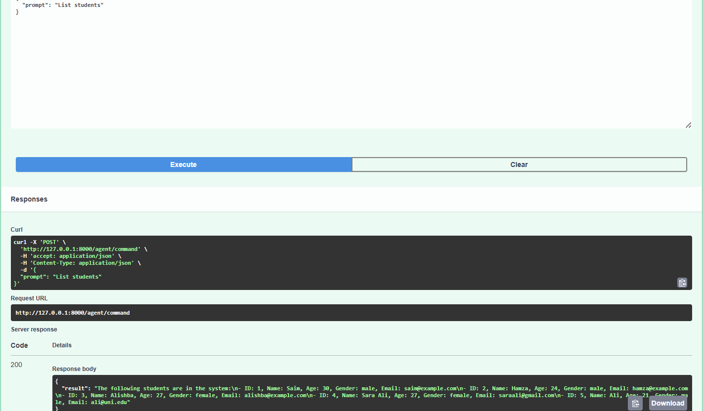
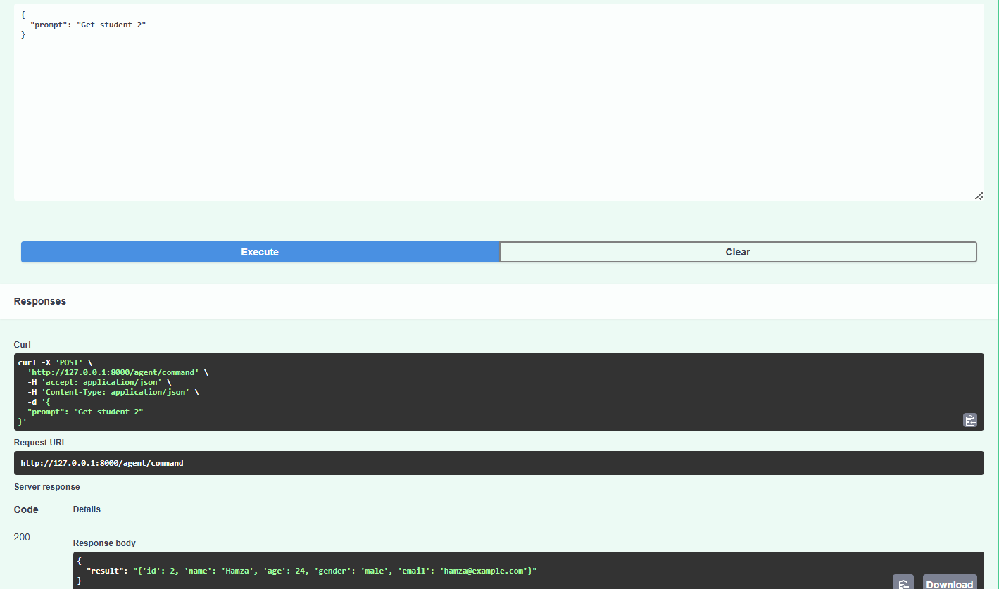
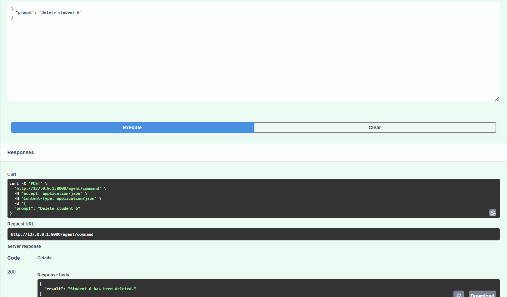

# FastAPI Student CRUD API + Gemini Agent

A simple **FastAPI project** implementing CRUD operations for managing students, with a **Google Gemini Agent** to process natural language commands.

## Features
- **CRUD Endpoints**
  - `GET /students` → Fetch all students
  - `GET /students/{id}` → Fetch a student by ID
  - `POST /students` → Add a new student
  - `PUT /students/{id}` → Update a student by ID
  - `DELETE /students/{id}` → Delete a student by ID
- **Agent Endpoint**
  - `POST /agent/command` → Accepts natural language prompts like:
    - `"Add student Sara Ali, 27, female, saraali@gmail.com"`
    - `"Update student 1 age to 28"`
    - `"Delete student 2"`
    - `"List students"`

## Requirements
- Python 3.10+
- FastAPI
- Uvicorn
- LangChain
- langchain-google-genai (Gemini support)

## Install dependencies:

pip install fastapi uvicorn langchain langchain-google-genai

## Run the Server

uvicorn main:app --reload

## API Endpoints & Testing

### **GET all students**

GET: http://127.0.0.1:8000/students

**Screenshot example:**

### **GET single student**

GET: http://127.0.0.1:8000/students/3

**Screenshot example:**

### **POST new student**

POST: http://127.0.0.1:8000/students

**Body (JSON):**

{
  "name": "Shafiq",
  "age": 30,
  "email": "shafiq@example.com",
  "gender": "male"
}

**Screenshot example:**

### **PUT update student**

PUT: http://127.0.0.1:8000/students/6

**Body (JSON):**

{
  "name": "Shafiq",
  "age": 30,
  "email": "shafiq.new@example.com",
  "gender": "male"
}

**Screenshot example:**

### **DELETE student**

DELETE: http://127.0.0.1:8000/students/6

**Screenshot example:**

## Agent Endpoints & Testing

### **GET all students**

GET: http://127.0.0.1:8000/agent/command

{
  "prompt": "List all students"
}

**Screenshot example:**

### **GET single student**

GET: http://127.0.0.1:8000/agent/command

{
  "prompt": "Get student 2"
}

**Screenshot example:**

### **POST new student**

POST: http://127.0.0.1:8000/agent/command

**Body (JSON):**

{
  "prompt": "Add student Raza, 21, male, raza@uni.edu"
}

**Screenshot example:**

### **PUT update student**

PUT: http://127.0.0.1:8000/agent/command

**Body (JSON):**

{
  "prompt": "Update student 1, change age to 31"
}

**Screenshot example:**

### **DELETE student**

DELETE: http://127.0.0.1:8000/agent/command

{
  "prompt": "Delete student 2"
}

**Screenshot example:**

## Notes

* The `id` is automatically generated.
* The student list is stored in memory, so it resets every time the server restarts.
* The agent requires a valid Google API key.