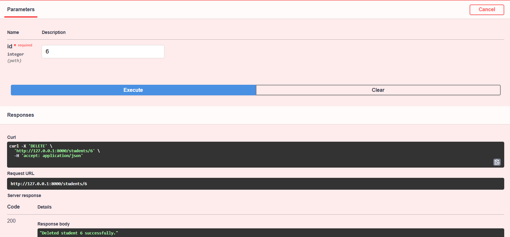

# FastAPI Student CRUD API

A simple FastAPI project implementing CRUD operations for managing students.

## Features
- **GET /students** → Fetch all students
- **GET /students/{id}** → Fetch a student by ID
- **POST /students** → Add a new student
- **PUT /students/{id}** → Update a student by ID
- **DELETE /students/{id}** → Delete a student by ID

## Requirements
- Python 3.10+
- FastAPI
- Uvicorn

## Install dependencies:

pip install fastapi uvicorn

## Run the Server

uvicorn main:app --reload

## API Endpoints & Testing

### **GET all students**

GET http://127.0.0.1:8000/students

**Screenshot example:**

### **GET single student**

GET http://127.0.0.1:8000/students/1

**Screenshot example:**

### **POST new student**

POST http://127.0.0.1:8000/students

**Body (JSON):**

{
  "name": "Sara Khan",
  "age": 22,
  "email": "sara.khan@example.com",
  "gender": "female"
}

**Screenshot example:**

### **PUT update student**

PUT http://127.0.0.1:8000/students/1

**Body (JSON):**

{
  "name": "Sara Khan Updated",
  "age": 23,
  "email": "sara.updated@example.com",
  "gender": "female"
}

**Screenshot example:**

### **DELETE student**

DELETE http://127.0.0.1:8000/students/1

**Screenshot example:**

## Notes

* The `id` is automatically generated.
* The student list is stored in memory, so it resets every time the server restarts.